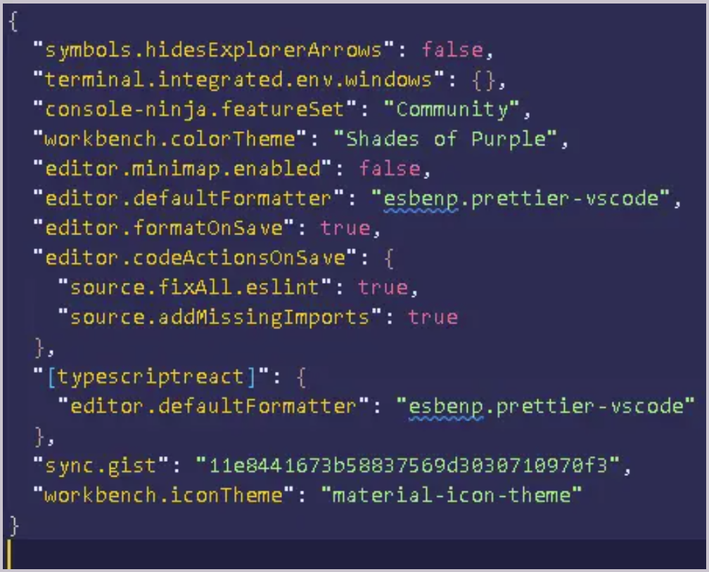

## Octopost LandPage w/ Next14

Boilerplate para projetos Devhat que utilizem next

### Starter cfg
 eslint
 tailwin lint
 styleguide exemplo
 

certifique-se de adicionar esse trecho de codigo em suas config json para o perfeito funcionamento dos linters

{
"editor.defaultFormatter": "esbenp.prettier-vscode",
"editor.formatOnSave": true,
"editor.codeActionsOnSave": {
"source.fixAll.eslint": true,
"source.addMissingImports": true
},
"[typescriptreact]": {
"editor.defaultFormatter": "esbenp.prettier-vscode"
}

}

